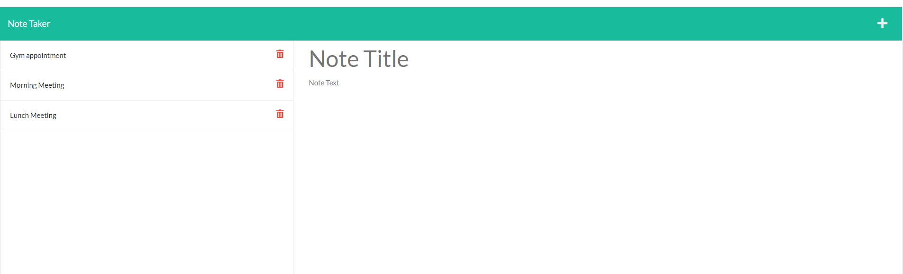

# Note Taker


## User Story

```
As a small business person I want a simple note taking app to keep track of tasks and activities during my busy day. I want to be able to add new notes, see them posted and delete notes within a basic user interface
```


## Acceptance Criteria

```
When I open the app I am taken to the home page where I can click on a button
to go to the notes page 
I am then presented with the existing notes on the left-column
and an empty field to add new notes and save them with the save button to render in the list on the left-column
When I click on the existing notes the notes populate to the right-column
If I want to add a new note I click on the + sign in the nav bar and can enter a new note
I can delete a note from the notes page by selecting it in the left-column and click on the delete icon

```


## Mock-Up

The following images show the web application's appearance and functionality:




### Technical Tools 

  * Application front end connects to an Express.js back end.

  * Application deployed to Heroku.

(https://heroku.com/)
(https://expressjs.com/)

## License


## 📝 Notes

- These are the (2) items required for submission
  1.  The URL of the deployed application on Heroku
      https://immense-wave-95168.herokuapp.com/
  2.  The URL of the GitHub repository that contains your code
      https://github.com/phagn131/note-taker-3

## Contact Information:
- Github: [phagn13@github.com](https://github.com/phagn13@github.com)
- Email: [chloetechnologies@gmail.com](user@email.com)
